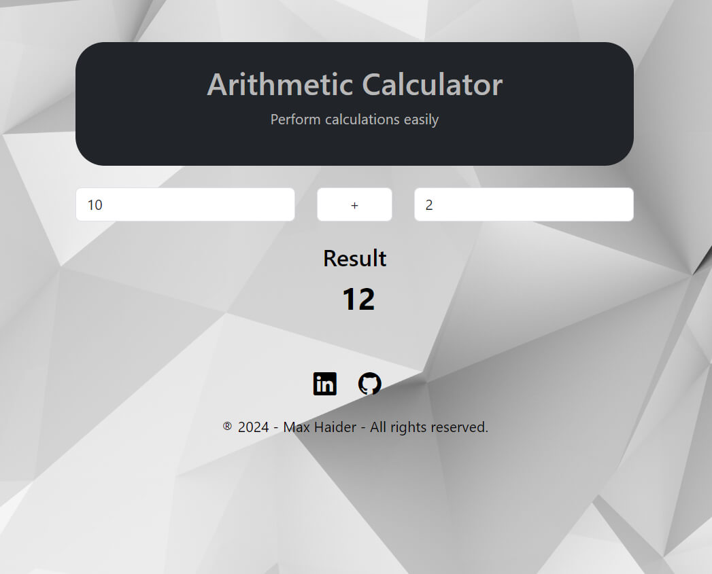

# Arithmetic-Calculator

This project is an arithmetic calculator built with Vue 3 and Vite. It allows users to perform basic arithmetic operations such as addition, subtraction, multiplication, and division.



<br>

## Check it Live on Versel 

[Arithmetic Calculator](https://arithmetic-calculator-kappa.vercel.app/)

## Recommended IDE Setup

[VSCode](https://code.visualstudio.com/) + [Volar](https://marketplace.visualstudio.com/items?itemName=Vue.volar) (and disable Vetur).

## Customize configuration

See [Vite Configuration Reference](https://vite.dev/config/).

## Project Setup

```sh
npm install
```

### Compile and Hot-Reload for Development

```sh
npm run dev
```

### Compile and Minify for Production

```sh
npm run build
```

## Usage

1. **Enter Numbers**: Input the numbers you want to calculate in the provided fields.
2. **Select Operation**: Choose the arithmetic operation (addition, subtraction, multiplication, or division) from the dropdown menu.
3. **View Result**: The result of the calculation will be displayed automatically as you input the numbers and select the operation.

This calculator is designed to be simple and user-friendly, making it easy to perform basic arithmetic operations quickly and efficiently.
